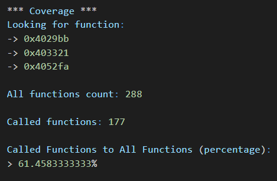

# Coverage


## Description

Small script to calculate percentage of callable functions from given functions.
Create file near script with name:
* ```func_list.txt``` with list of desired names to functions or 
* ```offset_list.txt``` with list of desired offsets

Output saves into files:
* ```idaout.txt``` - results
* ```func_functions.txt``` - list of callable functions
* ```func_to_do.txt``` - list of *not* callable functions

It's sketch, was written to learn how to use IDAPython in general.

## Source
```
.
├── coverage.py
└── example
    └── run.bat
```

## Run

To run an example you should set environment variable ```IDA_PATH``` or change a little ```run.bat``` file.